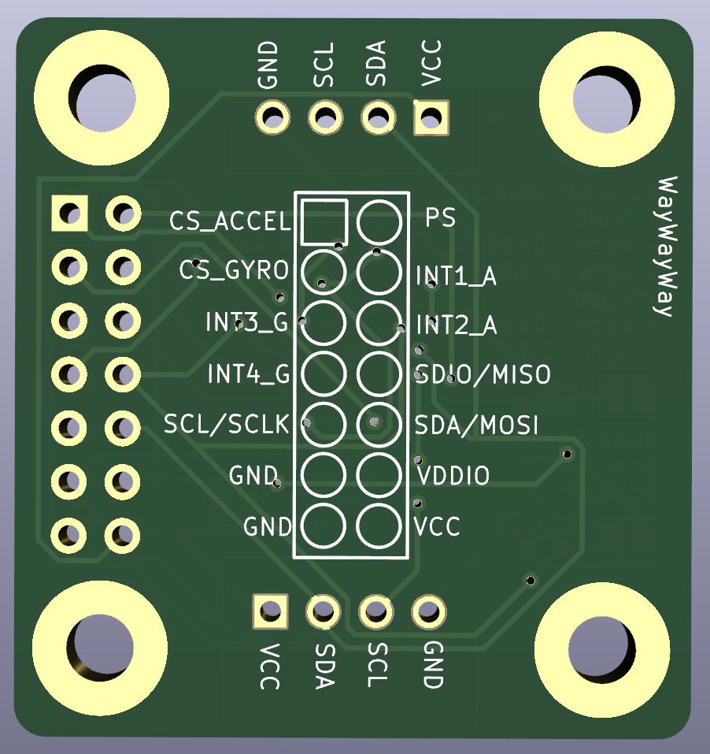

#Breakout Board for BMI088 Accelerometer/Gyroscrope
Provides breakouts for all pins, 2 headers for the I2C wires to allow daisy chaining, address selection jumper, mode select jumper, the option to bridge VDD and VDDIO as the supply voltage range overlaps for 3.3v logic level.

